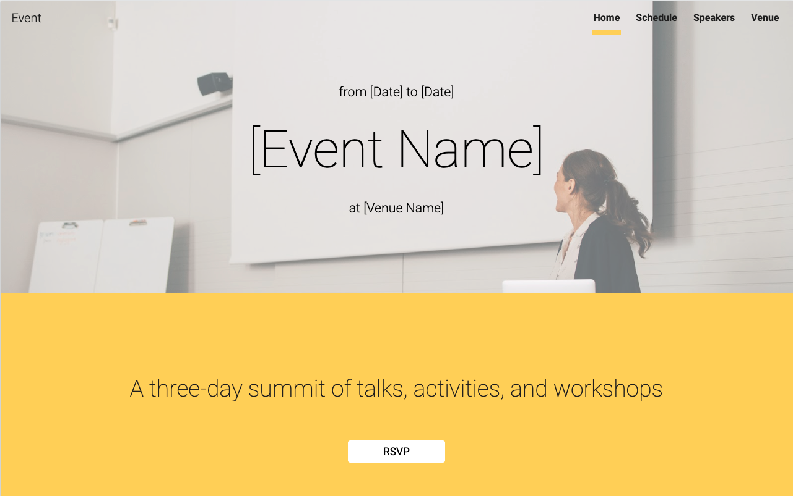

# google-sites-event
> HTML, CSS and Javascript project.

This is an HTML CSS and Javascript challenge. 
The goal is to do a simple page using the tecnologies above. 
See the live site at: https://ericasugui.github.io/google-sites-event/

## Meta

Erica Akira – [@ericaakira](https://twitter.com/ericaakira) – ericasugui@gmail.com

Distributed under the XYZ license. See ``LICENSE`` for more information.

[https://github.com/EricaSugui/](https://github.com/EricaSugui/)

## Contributing

1. Fork it (<https://github.com/EricaSugui/google-sites-event/fork>)
2. Create your feature branch (`git checkout -b feature/fooBar`)
3. Commit your changes (`git commit -am 'Add some fooBar'`)
4. Push to the branch (`git push origin feature/fooBar`)
5. Create a new Pull Request

<!-- Markdown link & img dfn's -->
[npm-image]: https://img.shields.io/npm/v/datadog-metrics.svg?style=flat-square
[npm-url]: https://npmjs.org/package/datadog-metrics
[npm-downloads]: https://img.shields.io/npm/dm/datadog-metrics.svg?style=flat-square
[travis-image]: https://img.shields.io/travis/dbader/node-datadog-metrics/master.svg?style=flat-square
[travis-url]: https://travis-ci.org/dbader/node-datadog-metrics
[wiki]: https://github.com/EricaSugui/google-sites-event/wiki
